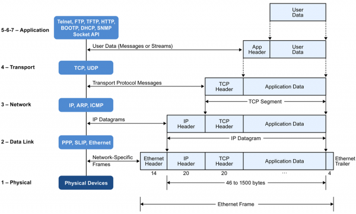

# Demystifying Protocol Stacks in Web Development

### What is a Protocol Stack?
- A protocol stack is a hierarchical set of communication protocols that govern how data is transferred between devices or software components. It organises the communication process into distinct layers, ensuring efficient and reliable data exchange.

### Layers of a Protocol Stack
1. Application Layer:
    - The application layer is the top layer of the protocol stack and is closest to the user or application. It manages communication between user software and the lower layers of the stack.
    - Example: HTTP (Hypertext Transfer Protocol) is an application layer protocol used for web browsers to request and display web pages. It defines how browsers and web servers communicate, enabling users to access websites.
2. Presentation Layer:
    - The presentation layer focuses on data translation, encryption, and compression. It ensures that data is presented in a format that both the sender and receiver can understand.
    - Example: SSL/TLS (Secure Sockets Layer/Transport Layer Security) is a presentation layer protocol. It encrypts data transmitted between web browsers and servers, ensuring secure and private communication.
3. Session Layer:
    - The session layer manages and maintains communication sessions or connections between devices or software components. It helps establish, maintain, and terminate connections.
    - Example: When you log in to a website, a session is created to maintain your interaction. If you log out, the session is terminated. This is facilitated by session layer protocols.
4. Transport Layer:
    - The transport layer is responsible for data segmentation, error checking, and end-to-end communication. It ensures data integrity and reliability.
    - Example: TCP (Transmission Control Protocol) is a transport layer protocol that provides reliable data transfer. It guarantees that data is delivered in the correct order and retransmits lost data if necessary.
5. Network Layer:
    - The network layer manages routing and addressing, determining how data packets should be forwarded through the network.
    - Example: IP (Internet Protocol) is a network layer protocol. It assigns unique IP addresses to devices and ensures data packets reach their intended destination across the internet.
6. Data Link Layer:
    - The data link layer handles data framing, error detection, and flow control, ensuring that data is transmitted accurately over a physical medium.
    - Example: Ethernet is a widely used data link layer protocol for wired local area networks (LANs). It specifies how data is framed and transmitted over Ethernet cables.
7. Physical Layer:
    - The physical layer represents the actual physical medium, such as cables or wireless signals, over which data is transmitted. It deals with raw data bit transmission.
    - Example: When data is transmitted over Wi-Fi, the physical layer manages the encoding, modulation, and transmission of radio waves between devices.

### How Protocol Stacks work in Web Development
- Protocol stacks are the backbone of communication in web development, allowing web applications to function smoothly and securely. Understanding these layers and their roles is essential for developers to create reliable and efficient web solutions.
- Example:  when you access a website, your browser uses the application layer protocol HTTP to request the web page from the server. The presentation layer may use encryption (SSL/TLS) to secure the data transfer, while the transport layer (TCP) ensures that the web page is delivered reliably. The network layer (IP) routes the data, and the data link and physical layers transmit it over the internet.

### Additional Resources
- https://www.geeksforgeeks.org/open-systems-interconnection-model-osi/
- https://www.ssla.co.uk/protocol-stack-developer/
