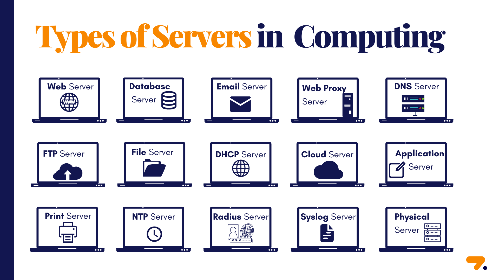

# Exploring the Diverse World of Web Servers Functionality and Performance Unveiled

### Introduction
- In our digital age, servers are the unsung heroes behind the scenes, powering the web, emails, and more. The server is similar to personal computers. Its components are the processor (CPU), memory (RAM), and hard disk. Servers contain hardware and programs that are tailored to their intended function. They come in various types, each with a unique role.

1. Web Servers
    - Web servers are fundamental to the internet, responsible for serving web content to users. They play a crucial role in determining how fast web pages load and how efficiently websites can handle user requests.
    - Examples: Apache HTTP Server, Nginx

2. Database Servers
    - Database servers store, manage, and provide access to data. They are essential for applications that rely on databases, from simple websites to complex business software.
    - Examples: MySQL, PostgreSQL
3. Email Servers
    - Email servers handle the sending, receiving, and storing of emails. They ensure that your emails reach their destination securely.
    - Examples: Postfix
4.  Web Proxy Servers
    - Web proxy servers act as intermediaries between client devices and web servers. They enhance performance, security, and accessibility.
    - Examples: Squid, HAProxy, Redis
5. DNS Servers
    - DNS servers resolve domain names to IP addresses, making web browsing possible. They are fundamental to internet infrastructure.
    - Examples: BIND(Berkeley Internet Name Domain), Microsoft DNS
6. FTP Servers
    - FTP (File Transfer Protocol) servers enable the secure and efficient transfer of files over the internet.
    - Examples: FileZilla Server
7. File Servers
    - File servers provide centralized file storage and sharing within a network.
    - Examples: Windows File Server
8. DHCP Servers
    - DHCP(Dynamic Host Configuration Protocol) servers dynamically assign IP addresses to devices on a network.
    - Examples: ISC DHCP, Windows DHCP Server
9. Cloud Servers
    - Cloud servers are virtualized instances provided by cloud service providers, such as AWS, Azure, and Google Cloud.
    - Examples: AWS, Azure, GCP
10. Physical Servers
    - Physical servers are dedicated hardware used for specific functions, such as web hosting or data storage
11. Print Servers
    - Print servers manage and share networked printers, making them accessible to multiple users.
    - Examples: CUPS (Common UNIX Printing System), Windows Print Server
12. NTP Servers
    - NTP (Network Time Protocol) servers synchronize time across networked devices, ensuring accurate timekeeping.
13. Radius server
    - RADIUS is a network protocol used for remote user authentication and authorization. While it plays a crucial role in network security, it's not involved in serving web content like web servers do.
14. Syslog Servers
    - Syslog servers collect and manage log data from various sources, aiding in troubleshooting and security analysis.
15. Application Server
    - An application server is software that runs on the server provide programs with protection and redundancy.

### Conclusion
- Servers are the backbone of our digital world, and knowing how they work ensures smoother experiences for everyone.

### Additional Resources
- https://www.zenarmor.com/docs/network-basics/types-of-servers#10-application-server
- https://www.indeed.com/career-advice/career-development/types-of-servers