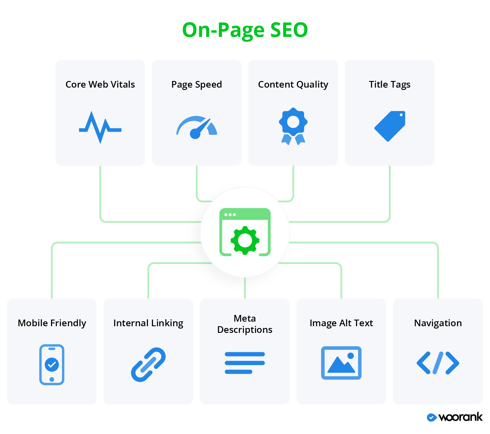
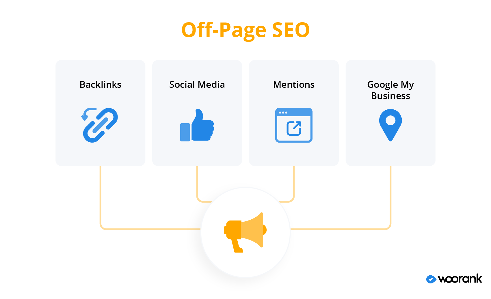

# Essential SEO for Web Developers

Search engines like Google and Bing rely on complex algorithms to determine which websites are most relevant to a user's search query. This relevance is primarily based on keywords and content quality. SEO involves two main aspects: on-page and off-page optimization.

### On-Page SEO Techniques
- High-Quality Content: Content is king in the world of SEO. Create informative, valuable, and engaging content that addresses the needs of your target audience.

- Keyword Research: Understand what keywords your target audience is searching for and incorporate them strategically into your content.

- Optimized Elements: Ensure that your titles, headings, and body content are keyword-optimized. Also, don't forget about meta descriptions and alt tags for images.

- User-Friendly URLs: Use descriptive and user-friendly URLs that reflect your content.

- Mobile-Friendliness: With the increasing use of mobile devices, it's crucial to have a responsive design for your website.

### Off-Page SEO Techniques
- Backlinks: Quality backlinks from authoritative websites can significantly boost your site's credibility. Focus on earning relevant and high-quality backlinks.

- Social Signals: Engage with your audience on social media platforms, as this can indirectly impact your search engine ranking.

- Online Reputation: Your online reputation matters. Encourage positive reviews and manage your brand's reputation online.

### Technical SEO Best Practices
- XML Sitemaps and Robots.txt: Use these tools to guide search engines in crawling your site efficiently.

- Site Structure and Navigation: A well-organized site structure makes it easier for search engines to understand your content.

- HTTPS and SSL Certificates: Secure your website with HTTPS, as it's a ranking factor and builds trust with users.

- Mobile Responsiveness: Make sure your site looks and functions well on mobile devices.

- Page Speed: Optimize your website for speed, as slower websites can lead to a higher bounce rate.

### Monitoring and Analytics
- Utilize tools like Google Analytics and Google Search Console to monitor your website's performance. Regularly check on your SEO efforts and make adjustments as needed.

### Staying Updated with Algorithm Changes
- Search engine algorithms are constantly evolving. Staying updated with the latest changes and trends in SEO is essential to maintain and improve your rankings.

### Additional Resources
https://www.woorank.com/en/blog/on-page-vs-off-page-seo-whats-the-difference