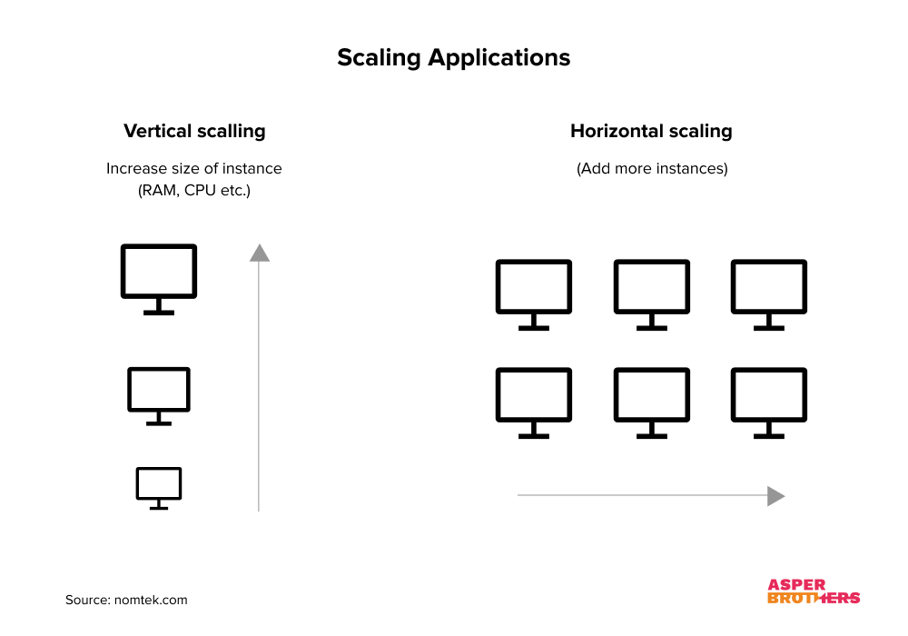

# Unlocking the Power of Scaling: A Vital Element for High-Performing Web Applications

Scaling refers to the process of expanding the capacity of a web application to handle increasing user traffic and data loads. 

### The Significance of Scaling in Web Applications

Scaling is pivotal for web applications for various reasons:

1. Handling Increased Traffic: Web applications often face traffic spikes, especially during marketing campaigns or product launches. Scaling allows your application to adapt to these fluctuations seamlessly.

2. Enhancing Performance: Improved performance leads to better user experiences, higher user satisfaction, and even increased revenue. Scaling can boost your application's speed and responsiveness.

3. Preparing for Future Growth: As your user base grows, so do the demands on your infrastructure. Scaling enables you to expand and accommodate this growth without a complete overhaul.

### Scaling Techniques

#### Vertical Scaling
Vertical scaling involves increasing the capacity of a single server by adding more resources, such as CPU, RAM, or storage. it has limitations such as cost constraints and potential single points of failure.

This approach is suitable when:
- Your application's performance bottleneck is a single component.
- You have a limited budget or infrastructure constraints.
- Quick scalability is required, without complex architecture changes.

#### Horizontal Scaling
Horizontal scaling entails adding more servers to distribute the workload. It provides cost-effective scalability but may introduce complexity in managing a cluster of servers.

This approach is preferred when:
- Your application's performance bottleneck is distributed across multiple components.
- You anticipate unpredictable traffic fluctuations.
- High availability and fault tolerance are critical.

### Additional Resources
- https://asperbrothers.com/blog/scaling-applications/